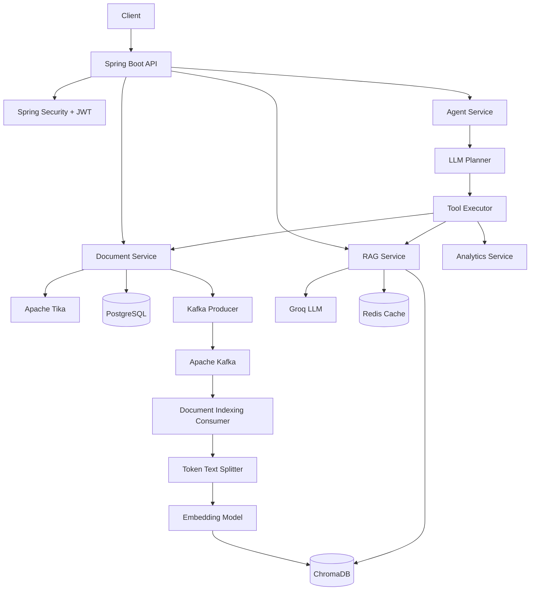
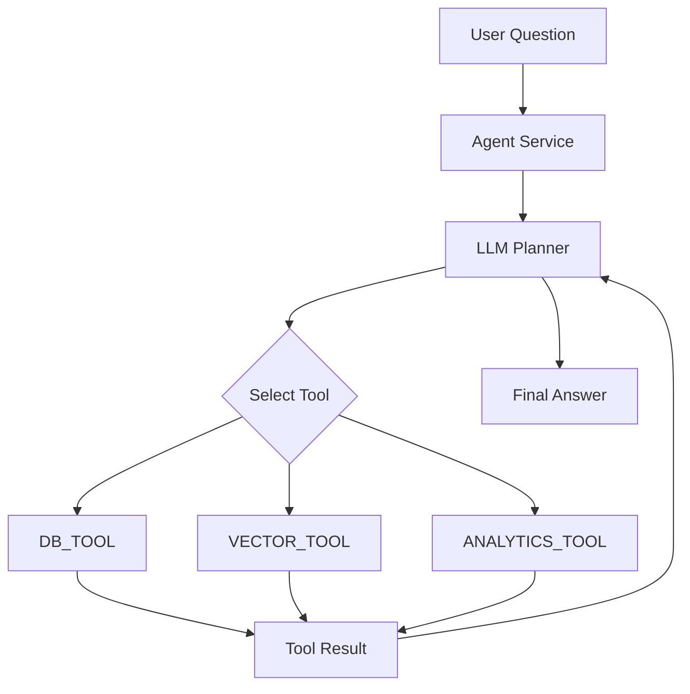

# AI Knowledge Assistant

An AI-powered knowledge assistant built with **Java, Spring Boot, Spring AI, Apache Kafka, Redis, PostgreSQL, ChromaDB, and JWT authentication**.

The system allows authenticated users to upload documents, asynchronously process and index their contents into a vector database, and ask natural-language questions using a **Retrieval-Augmented Generation (RAG)** pipeline.

The project also includes an **experimental agentic layer** where an LLM planner can select between different backend tools for document retrieval, vector search, and analytics operations.

---

## 🚀 Highlights

* 🔐 JWT-based authentication with BCrypt password hashing
* 📄 Document upload and text extraction using Apache Tika
* ⚡ Asynchronous document indexing using Apache Kafka
* 🧩 Token-based document chunking
* 🔎 Semantic vector search using ChromaDB
* 🤖 RAG-based question answering using Spring AI
* 🧠 Groq-powered LLM integration
* 🗄️ PostgreSQL for persistent application data
* ⚡ Redis caching for repeated RAG queries
* 🛡️ Resilience4j retry and circuit-breaker patterns
* 📊 Spring Boot Actuator for health and metrics
* 🧪 Experimental LLM-based agent/tool selection
* 🐳 Docker Compose-based local infrastructure

---

# 🏗️ Architecture



---

# 🔄 How It Works

## 1. Authentication

Users register and authenticate through the authentication API.

Passwords are hashed using **BCrypt**, and successful authentication returns a JWT token.

Protected endpoints require a valid JWT and the application uses stateless Spring Security configuration.

```text
Client
   |
   v
Register / Login
   |
   v
Spring Security
   |
   v
BCrypt Password Hashing
   |
   v
JWT Token
   |
   v
Protected APIs
```

---

# 📄 2. Document Upload

Authenticated users can upload documents through the document API.

The backend:

1. Receives the uploaded document.
2. Extracts text using **Apache Tika**.
3. Stores document metadata in PostgreSQL.
4. Creates a `PENDING` indexing state.
5. Publishes an indexing event to Kafka.

This separates document upload from the potentially expensive indexing process.

```text
Document Upload
       |
       v
 Apache Tika
       |
       v
 PostgreSQL
       |
       v
 Kafka Producer
       |
       v
 document-indexing topic
```

---

# ⚡ 3. Asynchronous Document Indexing

Kafka is used to decouple document ingestion from vector indexing.

The indexing consumer processes documents asynchronously.

```text
Kafka Consumer
      |
      v
Text Extraction
      |
      v
TokenTextSplitter
      |
      v
Embedding Model
      |
      v
ChromaDB
```

The document indexing lifecycle is represented by:

```text
PENDING
   |
   v
INDEXING
   |
   v
INDEXED
```

If indexing fails, the document can enter the:

```text
FAILED
```

state.

### Why Kafka?

Document processing can involve:

* Text extraction
* Chunking
* Embedding generation
* Vector database operations

Moving this work to an asynchronous consumer prevents these operations from being tightly coupled to the document upload request.

---

# 🧠 4. Retrieval-Augmented Generation

When a user asks a question, the RAG pipeline performs semantic retrieval before generating an answer.

```text
User Question
      |
      v
Vector Similarity Search
      |
      v
Retrieve Top 5 Chunks
      |
      v
Build Context
      |
      v
Context + Question
      |
      v
LLM
      |
      v
Grounded Answer
      |
      v
Sources
```

The application retrieves the five most relevant document chunks from ChromaDB.

These chunks are combined into a context that is supplied to the language model.

The system prompt instructs the model to:

* Answer using the supplied context.
* Avoid unsupported assumptions.
* Indicate when the requested information is not available in the uploaded documents.

The response also contains the filenames used as sources.

---

# ⚡ 5. Redis Query Caching

Repeated RAG queries can result in unnecessary LLM requests.

The application therefore uses **Redis** to cache RAG responses.

The query is normalized using:

```java
question.toLowerCase().trim()
```

The normalized question is used as the cache key.

```text
User Question
      |
      v
Normalize Query
      |
      v
Redis Cache
   /       \
 HIT       MISS
  |          |
  v          v
Return     RAG Pipeline
Answer        |
              v
          LLM Response
              |
              v
          Redis Cache
```

This avoids repeatedly calling the external LLM provider for identical queries.

---

# 🛡️ 6. Resilience

External AI services are treated as unreliable external dependencies.

The application uses **Resilience4j** to provide:

* Retry
* Circuit Breaker
* Fallback handling

```text
RAG Service
     |
     v
External LLM
     |
     +---- Failure ----+
     |                 |
     v                 v
   Retry         Circuit Breaker
                       |
                       v
                   Fallback
```

The circuit breaker can temporarily prevent additional calls when the failure threshold is reached.

If retries are exhausted or the circuit is open, the application returns a controlled fallback response instead of allowing the external failure to propagate uncontrolled through the application.

---

# 🤖 7. Experimental Agentic Layer

The project also contains an experimental agent architecture.

An LLM-based planner determines which tool should handle a request.

Currently available tools include:

| Tool             | Purpose                               |
| ---------------- | ------------------------------------- |
| `DB_TOOL`        | Retrieve document-related information |
| `VECTOR_TOOL`    | Perform vector/RAG-related operations |
| `ANALYTICS_TOOL` | Perform analytics operations          |

The planner produces a structured decision similar to:

```json
{
  "tool": "VECTOR_TOOL",
  "input": "Find information about supplier costs"
}
```

The `AgentService` executes the selected tool and can feed the result back into the planner.

The agent is restricted to a maximum of **3 execution steps**.

### Agent Flow



> **Note:** The agent/tool layer is experimental. Some tool implementations are placeholders intended for future extension.

---

# 🔐 Security

The application uses Spring Security with JWT-based stateless authentication.

### Security components

* Spring Security
* JWT
* BCrypt
* Stateless authentication
* Protected API endpoints

Authentication flow:

```text
Username + Password
        |
        v
Authentication
        |
        v
BCrypt Verification
        |
        v
JWT Token
        |
        v
Authorization Header
        |
        v
Protected API
```

Secrets and API credentials should be supplied through environment variables rather than committed to the repository.

---

# 🧩 Key Features

| Feature             | Technology            |
| ------------------- | --------------------- |
| Backend API         | Spring Boot           |
| Authentication      | Spring Security + JWT |
| Password Hashing    | BCrypt                |
| Document Processing | Apache Tika           |
| Async Processing    | Apache Kafka          |
| Text Chunking       | TokenTextSplitter     |
| Vector Database     | ChromaDB              |
| LLM Integration     | Spring AI + Groq      |
| Embeddings          | Ollama                |
| Relational Database | PostgreSQL            |
| Caching             | Redis                 |
| Resilience          | Resilience4j          |
| Monitoring          | Spring Boot Actuator  |
| Build               | Maven                 |
| Infrastructure      | Docker Compose        |

---

# 🛠️ Technology Stack

## Backend

* Java 17
* Spring Boot 3.2
* Spring Web
* Spring Security
* Spring Data JPA
* Hibernate
* Spring AI

## AI / RAG

* Spring AI
* Groq
* Llama-based LLM
* Ollama
* ChromaDB
* Vector similarity search
* TokenTextSplitter

## Messaging

* Apache Kafka
* Zookeeper

## Data

* PostgreSQL
* Redis
* ChromaDB

## Security

* Spring Security
* JWT
* BCrypt

## Resilience & Observability

* Resilience4j
* Spring Boot Actuator
* Logback
* Logstash Encoder

## Build & Infrastructure

* Maven
* Docker
* Docker Compose

---

# 📁 Project Structure

```text
ai-knowledge-assistant/
│
├── docker-compose.yml
│
├── backend/
│   └── ai-knowledge-assistant/
│       │
│       ├── pom.xml
│       │
│       └── src/
│           ├── main/
│           │   ├── java/
│           │   │   └── com/ai_knowledge_assistant/
│           │   │
│           │   └── resources/
│           │       └── application.yaml
│           │
│           └── test/
│
├── .gitignore
├── mvnw
├── mvnw.cmd
└── README.md
```

The backend is organized around functional areas:

```text
auth/
document/
kafka/
rag/
agent/
analytics/
query/
config/
exception/
```

---

# 🚀 Running Locally

## Prerequisites

Install the following:

* Java 17
* Maven
* Docker
* Docker Compose
* Ollama

You will also need credentials for the configured LLM provider.

---

## 1. Clone the Repository

```bash
git clone https://github.com/mayankgz/ai-knowledge-assistant.git

cd ai-knowledge-assistant
```

---

## 2. Start Infrastructure

From the project root:

```bash
docker compose up -d
```

This starts:

* PostgreSQL
* Redis
* Kafka
* Zookeeper
* ChromaDB

---

## 3. Configure Environment Variables

Do **not** commit API keys, passwords, JWT secrets, or other credentials to GitHub.

Configure the required values through environment variables or a local configuration file.

Example:

```yaml
spring:
  ai:
    openai:
      api-key: ${GROQ_API_KEY}

jwt:
  secret: ${JWT_SECRET}
```

Example environment variables:

```bash
GROQ_API_KEY=<your-api-key>
JWT_SECRET=<your-jwt-secret>
```

---

## 4. Start the Backend

Navigate to the backend directory:

```bash
cd backend/ai-knowledge-assistant
```

Run:

```bash
./mvnw spring-boot:run
```

On Windows:

```bash
mvnw.cmd spring-boot:run
```

---

# 🔌 API Overview

## Authentication

### Register

```http
POST /api/v1/auth/register
```

### Login

```http
POST /api/v1/auth/login
```

The login response provides a JWT token that must be supplied when accessing protected endpoints.

---

## Documents

### Upload Document

```http
POST /api/v1/documents
```

Multipart parameter:

```text
file
```

### List Documents

```http
GET /api/v1/documents
```

### Delete Document

```http
DELETE /api/v1/documents/{id}
```

---

## Query

### Ask a Question

```http
POST /api/v1/query
```

Parameter:

```text
question
```

Example:

```text
What caused the increase in supplier costs?
```

Example response:

```json
{
  "answer": "...",
  "sources": [
    "example.pdf"
  ]
}
```

---

## Agent

The experimental agent endpoint is:

```http
GET /api/v1/agent
```

Parameter:

```text
question
```

The planner determines which available tool should handle the request.

---

# 💡 Design Decisions

## Why Kafka?

Document indexing involves potentially expensive processing such as:

* Text extraction
* Chunking
* Embedding generation
* Vector storage

Kafka allows this processing to happen asynchronously instead of blocking the document upload request.

---

## Why ChromaDB?

The application needs semantic retrieval over document chunks.

ChromaDB provides the vector storage and similarity-search layer required by the RAG pipeline.

---

## Why Redis?

Repeated questions can produce the same response.

Redis provides a cache layer that reduces unnecessary calls to the external LLM service.

---

## Why Resilience4j?

The LLM provider is an external dependency.

Retry and circuit-breaker patterns help isolate the application from temporary failures in the external AI service.

---

## Why JWT?

The application uses stateless authentication.

JWT allows protected APIs to validate the authenticated user without maintaining server-side HTTP sessions.

---

# 📈 Engineering Concepts Demonstrated

This project was designed to explore practical backend engineering concepts beyond basic CRUD APIs.

### Distributed Systems

* Asynchronous processing
* Event-driven architecture
* Kafka producers and consumers
* External service failure handling

### Backend Architecture

* Layered Spring Boot architecture
* Feature-based package organization
* Service/repository separation
* Centralized exception handling

### AI Engineering

* Retrieval-Augmented Generation
* Vector databases
* Embeddings
* Semantic search
* Prompt-based grounding
* LLM tool selection

### Performance

* Redis caching
* Asynchronous document processing
* Vector retrieval

### Reliability

* Retry
* Circuit breaker
* Fallback
* External dependency isolation

### Security

* JWT authentication
* BCrypt password hashing
* Stateless Spring Security

---

# ⚠️ Current Limitations

This is a **learning and portfolio project rather than a production deployment**.

Current areas for improvement include:

* More comprehensive automated tests
* Stronger document ownership checks during vector retrieval
* More robust Kafka failure and retry handling
* Improved vector-store document deletion
* External secret management for production deployments
* Persistent agent/tool implementations
* More complete analytics functionality
* OpenAPI/Swagger documentation
* Improved observability and distributed tracing
* Containerized application deployment
* Rate limiting for external LLM calls

---

# 🔮 Future Improvements

Planned improvements include:

* [ ] Streaming LLM responses
* [ ] Conversation/session memory
* [ ] Richer document metadata filtering
* [ ] Persistent analytics tools
* [ ] Additional document formats
* [ ] Role-based access control
* [ ] RAG evaluation metrics
* [ ] Automated integration tests
* [ ] AWS deployment
* [ ] CI/CD pipeline
* [ ] OpenTelemetry-based distributed tracing
* [ ] Improved Kafka retry and dead-letter handling
* [ ] More robust document-level authorization

---

# 🎯 What This Project Demonstrates

The primary goal of this project is to demonstrate how a modern **Java/Spring Boot backend** can integrate AI capabilities while maintaining conventional backend engineering practices.

The system combines:

```text
Spring Boot
     +
Spring Security
     +
Kafka
     +
PostgreSQL
     +
Redis
     +
Vector Database
     +
LLM
     +
RAG
     +
Resilience Patterns
```

rather than treating the LLM as an isolated feature.

---

# 👨‍💻 Author

## Mayank Gagneja

Backend Software Engineer specializing in:

* Java
* Spring Boot
* Distributed Systems
* Kafka
* Redis
* PostgreSQL
* AWS
* AI / RAG

### Connect

**LinkedIn:**
[linkedin.com/in/mayank-gagneja](https://www.linkedin.com/in/mayank-gagneja)

**GitHub:**
[github.com/mayankgz](https://github.com/mayankgz)

---

⭐ If you find this project useful, feel free to explore the repository and the other backend projects on my GitHub.
