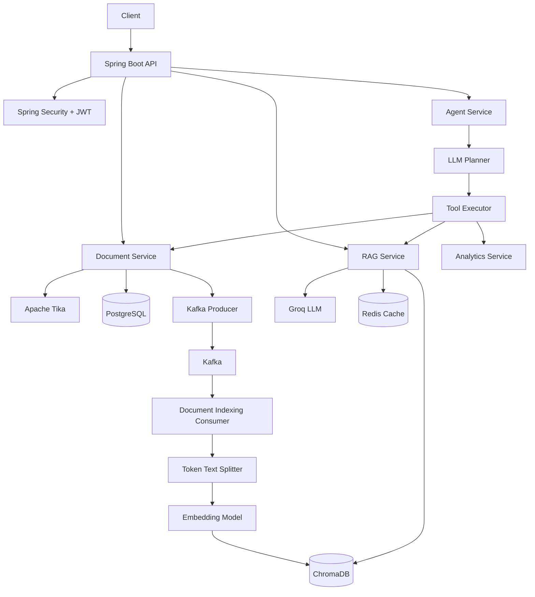

# AI Knowledge Assistant

An AI-powered knowledge assistant built with **Java, Spring Boot, Spring AI, PostgreSQL, Kafka, Redis, ChromaDB, and JWT authentication**.

The application allows authenticated users to upload documents, asynchronously index their contents into a vector store, and ask questions that are answered using Retrieval-Augmented Generation (RAG).

The project also includes an experimental **agentic tool-selection layer** that allows an LLM to decide whether a request should be handled through document retrieval, vector search, or analytics.

---

## Architecture



---

## How It Works

### 1. User Authentication

Users register and log in through the authentication API.

Passwords are stored using **BCrypt**, while successful authentication returns a **JWT token**.

Protected APIs require a valid JWT and the application uses a stateless Spring Security configuration.

---

### 2. Document Upload

Authenticated users can upload documents through the document API.

The backend:

1. Receives the uploaded file.
2. Extracts text using **Apache Tika**.
3. Stores document metadata in PostgreSQL.
4. Creates a `PENDING` indexing status.
5. Publishes an indexing event to Kafka.

The document content is therefore decoupled from the indexing process.

---

### 3. Asynchronous Document Indexing

Kafka is used to decouple document upload from vector indexing.

```text
Document Upload
      |
      v
PostgreSQL
      |
      v
Kafka Producer
      |
      v
document-indexing topic
      |
      v
Kafka Consumer
      |
      v
Text Chunking
      |
      v
Embeddings
      |
      v
ChromaDB
```

The document status progresses through:

```text
PENDING → INDEXING → INDEXED
```

The document model also supports a `FAILED` state for indexing failures.

---

## 4. RAG Pipeline

When a user asks a question, the RAG service performs the following steps:

```text
Question
   ↓
Vector Similarity Search
   ↓
Retrieve Top 5 Chunks
   ↓
Build Context
   ↓
Send Context + Question to LLM
   ↓
Generate Grounded Answer
   ↓
Return Answer + Sources
```

The application retrieves the five most relevant document chunks using vector similarity search.

The retrieved chunks are combined into a context which is provided to the language model.

The system prompt instructs the model to answer using only the supplied context and to indicate when the requested information is not available in the uploaded documents.

The response also contains the filenames of the documents used as sources.

---

## 5. Caching

Frequently repeated RAG questions are cached using Redis.

The query is normalized using:

```text
question.toLowerCase().trim()
```

and used as the cache key.

This avoids repeatedly calling the external LLM service for identical questions.

---

## 6. Resilience

External AI calls are protected using **Resilience4j**.

The RAG service uses:

* Retry
* Circuit Breaker
* Fallback handling

The circuit breaker monitors failures from the AI service and temporarily prevents additional calls when the failure threshold is reached.

If retries are exhausted or the circuit is open, the application returns a controlled fallback response instead of propagating the external service failure to the user.

---

# Agentic Layer

The project also contains an experimental agent architecture.

The agent uses an LLM-based planner to determine which tool should handle a request.

Available tools currently include:

| Tool             | Purpose                               |
| ---------------- | ------------------------------------- |
| `DB_TOOL`        | Retrieve document-related information |
| `VECTOR_TOOL`    | Perform vector/RAG-related operations |
| `ANALYTICS_TOOL` | Perform analytics operations          |

The planner returns a structured decision:

```json
{
  "tool": "VECTOR_TOOL",
  "input": "..."
}
```

The `AgentService` executes the selected tool and feeds its result back into the planner.

The agent is restricted to a maximum of **3 execution steps**.

The planner is also instructed to avoid assumptions and base the final answer on tool results.

> Note: The agent/tool layer is currently experimental. Some tool implementations are placeholders intended for extending the system with additional capabilities.

---

# Key Features

* JWT-based authentication
* BCrypt password hashing
* Stateless Spring Security
* Document upload and management
* Apache Tika document text extraction
* PostgreSQL document metadata persistence
* Kafka-based asynchronous document indexing
* Token-based document chunking
* Vector similarity search
* ChromaDB vector storage
* Spring AI integration
* Groq-powered LLM responses
* Ollama-based embedding configuration
* Redis query caching
* Resilience4j retry and circuit breaker
* Centralized exception handling
* LLM-based experimental tool planning
* Actuator health/metrics endpoints

---

# Technology Stack

### Backend

* Java 17
* Spring Boot 3.2
* Spring Web
* Spring Security
* Spring Data JPA
* Spring AI

### AI / RAG

* Spring AI
* Groq
* Llama-based model
* Ollama
* ChromaDB
* Vector similarity search
* TokenTextSplitter

### Messaging

* Apache Kafka
* Zookeeper

### Data

* PostgreSQL
* Redis
* ChromaDB

### Security

* Spring Security
* JWT
* BCrypt

### Resilience / Observability

* Resilience4j
* Spring Boot Actuator
* Logback / Logstash encoder

### Build

* Maven

---

# Project Structure

```text
ai-knowledge-assistant/
│
├── docker-compose.yml
│
└── backend/
    └── ai-knowledge-assistant/
        │
        ├── pom.xml
        │
        └── src/
            ├── main/
            │   ├── java/
            │   │   └── com/ai_knowledge_assistant/
            │   │
            │   └── resources/
            │       └── application.yaml
            │
            └── test/
```

The main backend is organized by feature:

```text
auth/
document/
kafka/
rag/
agent/
analytics/
query/
config/
exception/
```

---

# Running Locally

## Prerequisites

Install:

* Java 17
* Maven
* Docker
* Docker Compose
* Ollama

You will also need credentials for the configured LLM provider.

---

## 1. Start Infrastructure

From the project root:

```bash
docker compose up -d
```

This starts:

* PostgreSQL
* Redis
* Kafka
* Zookeeper
* ChromaDB

---

## 2. Configure Environment Variables

Do not commit API keys or secrets to GitHub.

Configure the required credentials through environment variables or a local configuration file.

Example:

```yaml
spring:
  ai:
    openai:
      api-key: ${GROQ_API_KEY}

jwt:
  secret: ${JWT_SECRET}
```

---

## 3. Start the Backend

Navigate to:

```bash
cd backend/ai-knowledge-assistant
```

Run:

```bash
./mvnw spring-boot:run
```

On Windows:

```bash
mvnw.cmd spring-boot:run
```

---

# API Overview

## Authentication

### Register

```http
POST /api/v1/auth/register
```

### Login

```http
POST /api/v1/auth/login
```

The login response provides a JWT token which must be supplied when accessing protected endpoints.

---

## Documents

### Upload Document

```http
POST /api/v1/documents
```

Multipart parameter:

```text
file
```

### List Documents

```http
GET /api/v1/documents
```

### Delete Document

```http
DELETE /api/v1/documents/{id}
```

---

## Query

### Ask a Question

```http
POST /api/v1/query
```

Parameter:

```text
question
```

Example:

```text
What caused the increase in supplier costs?
```

Response:

```json
{
  "answer": "...",
  "sources": [
    "example.pdf"
  ]
}
```

---

## Agent

The experimental agent endpoint is:

```http
GET /api/v1/agent
```

Parameter:

```text
question
```

The planner determines which available tool should handle the request.

---

# Design Decisions

### Why Kafka?

Document indexing can be separated from the upload request.

This prevents potentially expensive text processing, chunking, and vector indexing from being tightly coupled to the document upload operation.

### Why ChromaDB?

A vector store is required to perform semantic retrieval over document chunks. ChromaDB provides the vector storage and similarity-search layer used by the RAG pipeline.

### Why Redis?

Repeated questions can return the same answer and therefore do not always require another LLM request.

Redis provides a cache layer for these repeated RAG queries.

### Why Resilience4j?

The LLM provider is an external dependency.

Retry and circuit-breaker patterns help prevent temporary external failures from causing uncontrolled failures in the application.

### Why JWT?

The application uses stateless authentication, allowing protected APIs to validate user identity without maintaining server-side HTTP sessions.

---

# Current Limitations

This project is a learning and portfolio project rather than a production deployment.

Current areas for improvement include:

* More comprehensive automated tests
* Stronger document ownership checks during vector retrieval
* More robust Kafka failure/retry handling
* Improved vector-store document deletion
* Production-grade secret management
* Persistent agent/tool implementations
* More complete analytics functionality
* API documentation with OpenAPI/Swagger
* Better observability and distributed tracing
* Containerized application deployment
* Rate limiting for external LLM calls

---

# Future Improvements

* Add streaming LLM responses
* Add conversation/session memory
* Add richer document metadata filtering
* Implement persistent analytics tools
* Add additional document formats
* Introduce role-based access control
* Add evaluation metrics for RAG quality
* Add automated integration tests
* Deploy the complete system to AWS
* Add CI/CD pipeline
* Add OpenTelemetry-based tracing

---

# Author

**Mayank Gagneja**

Backend Software Engineer specializing in:

* Java
* Spring Boot
* Distributed Systems
* Kafka
* Redis
* AWS
* AI / RAG

LinkedIn: `linkedin.com/in/mayankgagneja`
x
